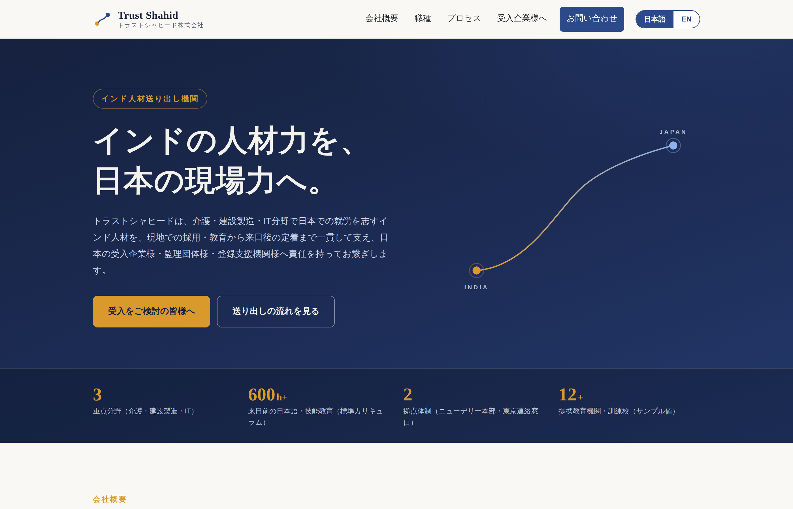
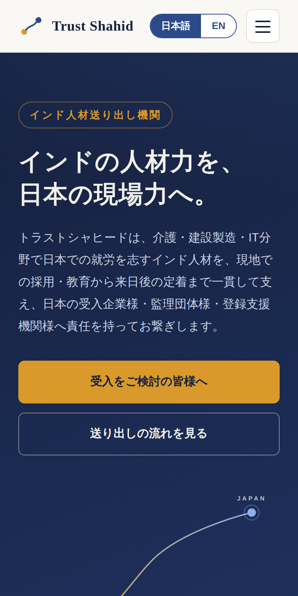
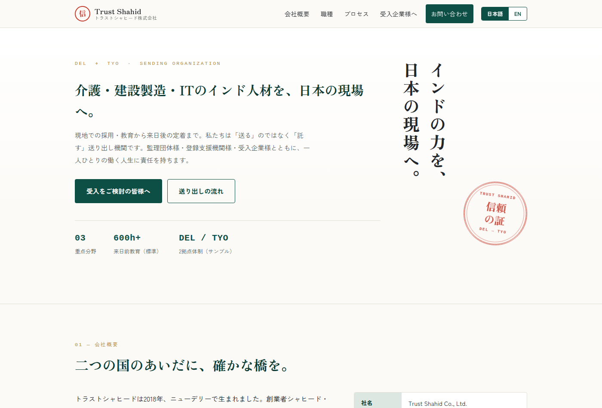

# Trust Shahid Co., Ltd. — sample marketing site

A sample (demo) marketing website for **Trust Shahid Co., Ltd.**, a fictional
India-based sending organization (送り出し機関) connecting Indian workers in
caregiving, construction/manufacturing, and IT to Japanese receiving
organizations (監理団体・登録支援機関・企業).

## Live demo

Two visual designs of the same content, deployed on Cloudflare:

| | URL | Design concept |
|---|---|---|
| **Design A** (original) | https://trust-shahid-website.hsushunlailaiphyo.workers.dev/ | 藍 (indigo) — the dye that traveled from India to Japan; a "crossing thread" connects the two countries |
| **Design B** (built following the [anthropics/skills frontend-design](https://github.com/anthropics/skills) skill) | https://trust-shahid-website.hsushunlailaiphyo.workers.dev/v2/ | 朱印 (vermilion seal) — travel documents and certification; 縦書き headline and a visa-style seal |

### Screenshots

**Design A** — indigo "crossing thread" concept:




**Design B** — vermilion seal concept, skill-guided:



**All company details, names, figures, and claims on the site are fictitious
placeholder content.** The site deliberately avoids asserting any specific
certification or registration status.

## Stack

Zero-build static site — semantic HTML + CSS + vanilla JS. No framework, no
build step, no backend.

```
index.html            single page (all sections), bilingual JP/EN
assets/css/style.css  styles (palette & design notes in the header comment)
assets/js/main.js     language toggle, mobile nav, contact-form handling
assets/favicon.svg    favicon
```

- **Language toggle (JP ⇄ EN)**: every piece of copy exists in the HTML twice
  (`<span class="ja" lang="ja">` / `<span class="en" lang="en">`); CSS shows one
  language based on `html[data-lang]`, and a small script persists the choice
  in `localStorage` and swaps `<title>`, meta description, and `<option>`
  labels. Japanese is the default.
- **Contact form**: frontend only. The place to wire a real submission handler
  is marked in `assets/js/main.js` (a Cloudflare Pages Function at
  `functions/api/contact.js` would be the natural fit).

## Deploying to Cloudflare Pages

The repo root **is** the build output — no build step.

1. Cloudflare dashboard → **Workers & Pages → Create → Pages → Connect to Git**
   and select this repository.
2. Settings:
   - **Framework preset**: None
   - **Build command**: *(leave empty)*
   - **Build output directory**: `/`
3. Deploy.

Or with Wrangler: `npx wrangler pages deploy .`

## Local preview

Any static server works, e.g.:

```sh
python3 -m http.server 8000
# open http://localhost:8000
```

## Design notes

Concept: **藍 (ai / indigo)** — the dye that historically traveled from India
to Japan and became "Japan blue"; the palette itself embodies the India–Japan
bridge, with a marigold/saffron gold as the single accent.

Palette: `#16213E` (deep indigo-navy) · `#2C4A8A` (indigo) · `#D9E2F0` (pale
indigo mist) · `#FAF8F4` (warm paper) · `#D99A2B` (saffron gold) · `#26292E`
(sumi text).

Type: Shippori Mincho B1 (display) + Noto Sans JP (body), via Google Fonts.

Signature element: the **crossing thread** — a single saffron-to-indigo line
drawn from "INDIA" to "JAPAN" in the hero, echoed as the gradient connector
bar on each process step.
